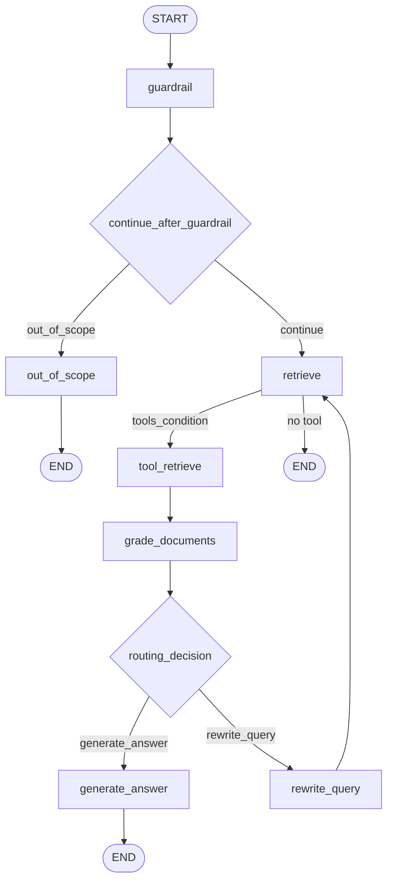

# Agentic RAG — `src/services/agents`

Tài liệu mô tả kiến trúc và luồng xử lý của module Agentic RAG dựa trên **LangGraph**.

## Mục đích

Hệ thống trả lời câu hỏi dựa trên **corpus paper arXiv** đã index trong OpenSearch: kiểm tra phạm vi câu hỏi (guardrail), truy vấn hybrid (BM25 + vector), đánh giá độ liên quan tài liệu, có thể **rewrite query** và thử retrieve lại, cuối cùng **sinh câu trả lời** bằng LLM (OpenRouter qua LangChain `ChatOpenAI`).

## Thành phần

### `AgenticRAGService` (`agentic_rag.py`)

- Khởi tạo clients (OpenSearch, LLM/OpenRouter, Jina embeddings), optional Langfuse.
- `_build_graph()`: dựng `StateGraph(AgentState, context_schema=Context)`.
- `ask(query, user_id, model)`: validate input, mở trace Langfuse (nếu bật), gọi `graph.ainvoke` với `state_input` và `context=Context(...)`.
- Trích `answer` từ message cuối trong `messages`, `sources` từ `relevant_sources`, build `reasoning_steps` tóm tắt.
- Tiện ích: `get_graph_mermaid()`, `get_graph_visualization()`, `get_graph_ascii()`.

### `GraphConfig` (`config.py`)

Tham số điều khiển graph: `max_retrieval_attempts` (mặc định 2), `guardrail_threshold` (0–100, mặc định 60), `model`, `temperature`, `top_k`, `use_hybrid`, v.v.

### `AgentState` (`state.py`)

TypedDict cho state LangGraph:

- `messages`: `Annotated[list[AnyMessage], add_messages]` — reducer append, không ghi đè toàn bộ history.
- `original_query`, `rewritten_query`, `retrieval_attempts`
- `guardrail_result`, `routing_decision`, `sources`, `relevant_sources`, `relevant_tool_artefacts`
- `grading_results`, `metadata`

### `Context` (`context.py`)

Dataclass **runtime dependencies**: clients LLM (OpenRouter)/OpenSearch/Jina, Langfuse `trace`, cờ `langfuse_enabled`, `model_name`, `temperature`, `top_k`, `max_retrieval_attempts`, `guardrail_threshold`. Được truyền qua `Runtime[Context]` vào mọi node; không phải state thay đổi theo từng bước graph.

### Tool (`tools.py`)

`create_retriever_tool(...)` trả về tool LangChain **`retrieve_papers`**: embed query (Jina), gọi `OpenSearchClient.search_unified` (BM25 và/hoặc vector), map hit → `langchain_core.documents.Document` với metadata (arxiv_id, title, authors, url, …).

### Factory (`factory.py`)

`make_agentic_rag_service(...)` tạo `GraphConfig` và `AgenticRAGService` — điểm vào tiện cho API / dependency injection.

### Models (`models.py`)

Pydantic: `GuardrailScoring`, `GradeDocuments`, `GradingResult`, `SourceItem`, `ToolArtefact`, `RoutingDecision`, `ReasoningStep`, …

### Prompts (`prompts.py`)

Template string cho guardrail, grade documents, rewrite, generate answer.

### Nodes (`nodes/`)

| Node | File | Chức năng |
|------|------|-----------|
| guardrail | `guardrail_node.py` | LLM structured → `GuardrailScoring`; router `continue_after_guardrail` so sánh score với `guardrail_threshold` |
| out_of_scope | `out_of_scope_node.py` | `AIMessage` từ chối lịch sự khi ngoài phạm vi |
| retrieve | `retrieve_node.py` | Tạo `tool_calls` cho `retrieve_papers`, hoặc fallback khi đạt `max_retrieval_attempts` |
| tool_retrieve | LangGraph `ToolNode` (trong `agentic_rag.py`) | Thực thi tool, thêm `ToolMessage` vào `messages` |
| grade_documents | `grade_documents_node.py` | LLM yes/no trên context; set `routing_decision` → `generate_answer` hoặc `rewrite_query` |
| rewrite_query | `rewrite_query_node.py` | LLM rewrite; append `HumanMessage` và `rewritten_query` |
| generate_answer | `generate_answer_node.py` | LLM sinh câu trả lời từ context + câu hỏi; append `AIMessage` |

### Utils (`nodes/utils.py`)

`get_latest_query`, `get_latest_context` (nội dung `ToolMessage` gần nhất), filter messages, helpers cho artefacts/sources.

## Sơ đồ luồng graph

### Luồng chi tiết: Guardrail (`guardrail_node.py`)

Guardrail là **bước đầu tiên** sau `START`: đánh giá xem câu hỏi có thuộc phạm vi **bài báo arXiv / CS·AI·ML** hay không, trước khi tốn chi phí retrieve + grading.

#### Vai trò

- Lọc query **ngoài domain** (chào hỏi, kiến thức phổ thông, toán đơn giản, chủ đề không liên quan nghiên cứu, …).
- Xuất **`GuardrailScoring`**: `score` (0–100) + `reason` (giải thích ngắn) — model Pydantic khớp JSON từ LLM.

#### Cấu hình liên quan (`Context` / `GraphConfig`)

| Tham số | Ý nghĩa |
|--------|---------|
| `guardrail_threshold` | Mặc định **60**. Điểm sàn: `score >= threshold` mới được coi là “trong phạm vi” và đi tiếp tới retrieve. |
| `model_name` | Model OpenRouter (qua LangChain `ChatOpenAI`) dùng cho bước chấm điểm. |
| `temperature` | **0.0** trong node guardrail — giảm ngẫu nhiên, chấm điểm ổn định hơn. |

#### Bước xử lý trong `ainvoke_guardrail_step`

1. **Lấy câu hỏi** — `get_latest_query(state["messages"])`: message người dùng mới nhất trong `messages`.
2. **Langfuse (tuỳ chọn)** — Nếu `langfuse_enabled` và có `trace`, tạo span `guardrail_validation` (input: query, threshold; metadata: node, model).
3. **Prompt** — `GUARDRAIL_PROMPT.format(question=query)` (`prompts.py`): hướng dẫn LLM chấm **0–100** theo rubric (80–100 rõ ràng research CS/AI/ML, 60–79 có thể liên quan, 40–59 mơ hồ, 0–39 không phải research).
4. **LLM + structured output** — `runtime.context.llm_client.get_langchain_model(..., temperature=0.0)` rồi `.with_structured_output(GuardrailScoring)` và `ainvoke(guardrail_prompt)`. Kết quả là object `GuardrailScoring` đã validate schema.
5. **Ghi span thành công** — Output gồm `score`, `reason`, và `decision` (`continue` / `out_of_scope`) so với threshold.
6. **Lỗi LLM / network / parse** — **Fallback bảo thủ**: `GuardrailScoring(score=50, reason=...)` để không chặn cứng toàn bộ pipeline; span (nếu có) đánh dấu `fallback: true`, level WARNING.

**Return vào state:** `{"guardrail_result": response}` — chỉ cập nhật field `guardrail_result`; các field state khác giữ nguyên.

#### Điều kiện rẽ nhánh: `continue_after_guardrail`

Đây **không** gọi LLM — chỉ đọc state sau node guardrail:

- Lấy `state["guardrail_result"]` và `runtime.context.guardrail_threshold`.
- Nếu **`score >= threshold`** → chuỗi **`"continue"`** → cạnh tới node **`retrieve`**.
- Nếu **`score < threshold`** → **`"out_of_scope"`** → node **`out_of_scope`** (thông báo lịch sự, không retrieve).

**Góc cạnh implementation:** Nếu **không có** `guardrail_result` (lỗi hiếm / state bất thường), hàm log warning *"No guardrail result… routing to out_of_scope"* nhưng **return `"continue"`** — tức vẫn cho đi retrieve. Khi đọc code hoặc debug, cần biết hành vi thực tế là **continue** chứ không phải `out_of_scope`.

#### Tóm tắt một dòng

**Prompt rubric → LLM structured `score`/`reason` → so sánh với `guardrail_threshold` → `retrieve` hoặc `out_of_scope` (fallback lỗi: điểm 50).**

### Mô tả từng bước

1. **guardrail** — LLM chấm điểm 0–100; lỗi LLM → fallback score 50.
2. **continue_after_guardrail** — `score >= guardrail_threshold` → `retrieve`; ngược lại → `out_of_scope` → END. (Nếu thiếu `guardrail_result`, code hiện tại vẫn route `"continue"` — xem mục Guardrail chi tiết phía trên.)
3. **retrieve** — Nếu hết lượt retrieve: một `AIMessage` giải thích; `tools_condition` có thể đi END. Nếu còn lượt: `AIMessage` với `tool_calls` → `tool_retrieve`.
4. **tool_retrieve** — Chạy `retrieve_papers`, cập nhật `messages` với kết quả tool.
5. **grade_documents** — Không có context từ tool → `rewrite_query`. Có context → LLM đánh giá; relevant → `generate_answer`, không → `rewrite_query`.
6. **rewrite_query** — Cạnh quay lại **retrieve** (vòng lặp tối đa `max_retrieval_attempts` lần retrieve thực sự).
7. **generate_answer** — END.

## Observability

- **Langfuse**: span theo node (guardrail, retrieve initiation, grading, rewriting, answer generation) khi `langfuse_enabled` và có `trace`; `CallbackHandler` gắn vào `config["callbacks"]` khi invoke graph.

## Phụ thuộc ngoài module

- `src.services.opensearch`
- `src.services.ollama`
- `src.services.embeddings.jina_client`
- Optional: `src.services.langfuse`

## Ghi chú triển khai

- **`relevant_sources`**: được khởi tạo rỗng trong `_run_workflow`; hiện không có node gán `SourceItem` từ kết quả tool vào state. API có thể trả `sources: []` cho đến khi bổ sung bước map `ToolMessage` / `Document` → `SourceItem`.
- **`utils.extract_sources_from_tool_messages`**: stub (chưa parse metadata paper); có thể mở rộng để điền `relevant_sources`.
