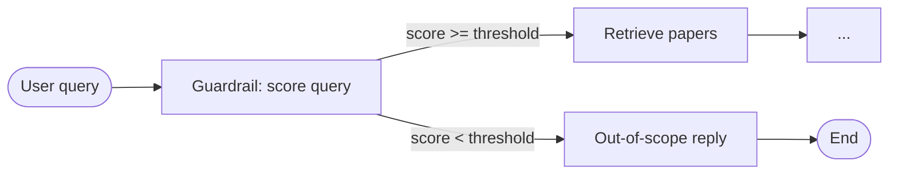

# Guardrails in this project (beginner-friendly guide)

This document explains **what guardrails are**, **why this codebase uses them**, and **exactly how they work** in the Agentic RAG flow. No prior experience with guardrails or LangGraph is required.

---

## 1. What is a “guardrail”?

In AI applications, a **guardrail** is a check that runs **before** expensive or sensitive steps (like searching a database or calling external tools). It answers questions such as:

- Is this user request allowed for *this* product?
- Is it on-topic for the data we have?
- Should we refuse politely instead of guessing?

Think of a guardrail as a **bouncer at the door**: it does not answer the research question itself; it only decides whether the question is allowed to enter the “retrieval + answer” path.

In **this project**, the guardrail’s job is narrow and clear:

> **Only let through questions that belong to academic CS / AI / ML research papers (arXiv-style scope).**  
> Everything else gets a **polite refusal** and **no document retrieval**.

That saves compute, avoids irrelevant search results, and keeps the assistant aligned with its domain.

---

## 2. Where the guardrail sits in the agent

The Agentic RAG system is built as a **LangGraph** workflow: a graph of steps (nodes) connected by edges. The **first** step after the user sends a message is always the guardrail.

- **Pass** → the graph continues to **retrieval** (search OpenSearch, grade chunks, generate an answer).
- **Fail** → the graph goes to **out-of-scope**: a fixed helpful message is returned, **retrieval never runs** (`retrieval_attempts` stays `0`).

Relevant code:

- Graph wiring: `src/services/agents/agentic_rag.py` (edges from `START` → `guardrail`, then conditional routing).
- Guardrail node: `src/services/agents/nodes/guardrail_node.py`.
- Out-of-scope node: `src/services/agents/nodes/out_of_scope_node.py`.

---

## 3. How scoring works (0–100 + threshold)

The guardrail does **not** use a simple keyword list. It asks an **LLM** to act as an evaluator and return a structured result:

| Field   | Meaning |
|--------|---------|
| `score` | Integer from **0** to **100** — how well the query fits the arXiv CS/AI/ML research scope |
| `reason` | Short text explaining the score (useful for debugging and observability) |

That structure is defined in code as `GuardrailScoring` in `src/services/agents/models.py`.

### The rubric (what the model is told)

The evaluator instructions live in `GUARDRAIL_PROMPT` in `src/services/agents/prompts.py`. They tell the model to assign bands like:

| Score range | Meaning (simplified) |
|-------------|----------------------|
| **80–100**  | Clearly CS/AI/ML research (e.g. transformers, BERT) |
| **60–79**   | In scope for arXiv-style answers, including broad ML/AI questions papers can inform (e.g. “What is machine learning?”) |
| **40–59**   | Too vague to justify retrieval (unclear domain) |
| **0–39**    | Clearly off-topic (general knowledge, greetings, math trivia, etc.) |

### The cutoff: **threshold**

The actual **decision** is numeric:

- If **`score >= guardrail_threshold`** → continue to retrieval.
- If **`score < guardrail_threshold`** → out-of-scope path.

The default threshold is **`60`**, set in:

- `src/services/agents/context.py` (`Context.guardrail_threshold`)
- `src/services/agents/config.py` (`GraphConfig.guardrail_threshold`)

So a query scored **59** fails; **60** passes. Small changes in the model’s judgment can flip the outcome—especially for short or ambiguous questions.

---

## 4. Step-by-step: what happens inside the guardrail node

File: `src/services/agents/nodes/guardrail_node.py`.

1. **Read the latest user message** from the conversation state (`get_latest_query`).
2. **Build the prompt** by filling `GUARDRAIL_PROMPT` with that question.
3. **Call the LLM (OpenRouter)** through the shared LangChain wrapper, with **`temperature=0.0`** so scoring is as stable as possible.
4. **Parse the reply** using **structured output** into `GuardrailScoring` (`score` + `reason`).
5. **Store** the result on state as `guardrail_result`.
6. **Optional observability**: if Langfuse is enabled, a span named `guardrail_validation` records query, threshold, score, reason, and whether the decision was `continue` or `out_of_scope`.

### If the LLM call fails

If structured scoring throws an error, the code uses a **fallback** `GuardrailScoring` with **score `50`** and a reason that mentions the failure. Because the default threshold is **60**, that fallback usually routes to **out-of-scope** (conservative and safe).

---

## 5. Routing after the guardrail

Function: `continue_after_guardrail` in `src/services/agents/nodes/guardrail_node.py`.

- Compares `guardrail_result.score` to `runtime.context.guardrail_threshold`.
- Returns the string **`"continue"`** or **`"out_of_scope"`**, which LangGraph maps to the next node (`retrieve` vs `out_of_scope`).

---

## 6. What the user sees when the guardrail fails

File: `src/services/agents/nodes/out_of_scope_node.py`.

The response is a **templated** message (not a second LLM call): it explains that the assistant only handles arXiv CS/AI/ML research papers, repeats the user’s question, and suggests other kinds of resources. **No papers are retrieved.**

In API responses, you will often see a reasoning step like:

`Validated query scope (score: XX/100)`

followed by either retrieval steps or this out-of-scope answer, depending on whether **XX** cleared the threshold.

---

## 7. How this differs from other steps in the agent

Beginners sometimes mix up **guardrail** with **document grading**. They are different:

| | Guardrail | Document grading |
|---|-----------|------------------|
| **When** | First step, before any search | After retrieval |
| **Question** | Is the *user query* in scope? | Are these *chunks* relevant to the query? |
| **Failure effect** | No retrieval | May rewrite query and retry retrieval |

Document grading uses other prompts and models in `grade_documents_node`; the guardrail only sees the **raw user question**.

---

## 8. Configuration (how to tune behavior)

- **Threshold**: Lower (e.g. `50`) lets more queries through; higher (e.g. `70`) is stricter. Change via `GraphConfig` when constructing `AgenticRAGService` (see `make_agentic_rag_service` in `src/services/agents/factory.py` and settings in `src/dependencies.py`).
- **Model**: The same Ollama model name in runtime context (`Context.model_name`) is used for guardrail scoring. Smaller models can be noisier on borderline questions; larger ones may be more consistent (at higher cost).
- **Prompt**: Editing `GUARDRAIL_PROMPT` in `src/services/agents/prompts.py` changes the rubric and examples the evaluator sees—often the most effective lever for systematic misfires (e.g. “LLM agents” topics scoring too low).

**API note:** `POST /api/v1/ask-agentic` currently calls the service with the **query string only** (`src/routers/agentic_ask.py`). The **model** used for the guardrail (and the rest of the graph) therefore comes from **app configuration** when the `AgenticRAGService` is created (`make_agentic_rag_service` + `llm.default_chat_model` / `settings.openrouter_model` in `src/dependencies.py`), not from optional JSON fields on the request unless you extend the router to pass `request.model` into `ask()`.

---

## 9. Quick glossary

| Term | Meaning here |
|------|----------------|
| **LangGraph** | Library that runs the agent as a graph of nodes and conditional edges. |
| **Node** | One step in the graph (e.g. `guardrail`, `retrieve`). |
| **State** | Data passed between nodes; includes `messages` and `guardrail_result`. |
| **Context** | Dependencies and settings (clients, threshold, model name) supplied at run time. |
| **Structured output** | Forcing the LLM to return JSON matching a schema (`GuardrailScoring`). |

---

## 10. Files to read in order

1. `src/services/agents/prompts.py` — `GUARDRAIL_PROMPT` (the rubric).
2. `src/services/agents/nodes/guardrail_node.py` — scoring + routing function.
3. `src/services/agents/nodes/out_of_scope_node.py` — user-facing refusal.
4. `src/services/agents/agentic_rag.py` — where the guardrail plugs into the graph.
5. `src/services/agents/models.py` — `GuardrailScoring` schema.

---

## Summary

- The **guardrail** is the **first** step of Agentic RAG: it scores whether the question fits **arXiv CS/AI/ML research**.
- **`score >= threshold` (default 60)** → retrieval and answering proceed.
- **`score < threshold`** → templated out-of-scope message, **no retrieval**.
- Scoring is **LLM-based** with **temperature 0** and **structured output**; failures fall back to a **conservative score of 50**.

If you want to go deeper next, trace a single request in **Langfuse** (span `guardrail_validation`) and compare `score`, `reason`, and `threshold` for queries that behave unexpectedly.
