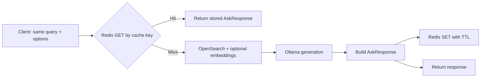

# Redis caching in this project (beginner-friendly guide)

This guide explains **what Redis is**, **why this RAG API uses it**, and **exactly how caching works** in this codebase. No prior Redis experience is assumed.

---

## 1. Caching in one minute

When a user asks a question, a full RAG answer normally involves several slow steps: search the vector index, maybe call an embedding API, run a local LLM, and assemble sources. If **the same question** (with the same options) is asked again soon, repeating all of that work is wasteful.

A **cache** stores the **result** of an expensive operation so the next time you see the **same inputs**, you can return the saved result quickly.

**Redis** is an in-memory data store that behaves like a very fast key–value database. This project stores serialized RAG responses in Redis under deterministic keys so repeated queries can be answered without re-running search and generation.

---

## 2. What is Redis?

- **In-memory**: Data lives primarily in RAM, so reads and writes are extremely fast compared to disk or full RAG pipelines.
- **Key–value**: You store a **value** (here: JSON text of an answer) under a **key** (here: a short hash derived from the request).
- **TTL (time to live)**: Entries can expire automatically after a set time so answers do not stay forever if your index or models change.
- **Optional persistence**: In Docker, the `rag-redis` service can use append-only files so data survives container restarts (within limits).

Redis is **not** a replacement for OpenSearch or PostgreSQL here; it only **speeds up repeat requests** for the ask endpoints.

---

## 3. Two Redis instances (do not mix them up)

The project’s `compose.yml` defines **two separate Redis servers**:

| Service           | Container name        | Purpose                                      |
|------------------|------------------------|----------------------------------------------|
| **`redis`**      | `rag-redis`            | **RAG response cache** for the API (this doc) |
| **`langfuse-redis`** | `rag-langfuse-redis` | **Langfuse** (tracing/queues), not your RAG answer cache |

Environment variables for the API use the prefix `REDIS__` and point at the **`redis`** service hostname inside Docker (`REDIS__HOST=redis`). Langfuse uses its own `REDIS_HOST` / password settings. Treat them as unrelated.

---

## 4. How caching fits in the RAG API

### 4.1 Where it runs in the stack

1. On startup, the FastAPI app builds a **`CacheClient`** backed by a Redis connection (`src/main.py`).
2. The **`POST /api/v1/ask`** and **`POST /api/v1/stream`** handlers check the cache **before** retrieval and generation, and **store** a successful result **after** (`src/routers/ask.py`).

The **agentic** RAG route is wired separately and does **not** use this Redis `CacheClient` in the same way as `/ask` and `/stream`—so “Redis caching” in this repo refers primarily to the **standard RAG ask/stream** flow.

### 4.2 End-to-end flow (mental model)

- **Cache hit**: Redis already has JSON for that key → return it immediately (no search, no LLM for that request).
- **Cache miss**: Run the normal pipeline, then **SET** the result with a TTL.

If Redis throws during a **read**, the ask handlers **log a warning and continue** without cache—so a transient cache failure does not automatically break the endpoint logic (the app still expects Redis to be up at **startup**; see below).

---

## 5. How cache keys are built (exact match)

Caching is **exact match**, not semantic similarity. Two questions must produce the **same key** to share a cache entry.

The key is built from a small JSON object that includes (`src/services/cache/client.py`):

- `query` — the user’s text (must match character-for-character for a hit)
- `model` — which Ollama model was requested
- `top_k` — how many chunks to retrieve
- `use_hybrid` — hybrid vs BM25-style behavior
- `categories` — optional list, **sorted** before hashing so order does not create duplicate keys

That object is serialized with sorted keys, hashed with **SHA-256**, and the first **16** hex characters are used. The Redis key looks like:

`exact_cache:<16-char-hex>`

**Implications for beginners:**

- Changing **any** of those fields (even extra spaces in `query`) → **new key** → cache miss.
- There is **no** “similar question” cache—only **identical** request parameters under this scheme.

---

## 6. What is stored in Redis?

The **value** is the JSON form of **`AskResponse`**: query, answer, sources, `chunks_used`, and `search_mode` (`src/schemas/api/ask.py`). That is enough to return the same payload (or to **simulate streaming** by splitting the cached answer into chunks on `/stream`).

**TTL** comes from settings: `REDIS__TTL_HOURS` (default **6** hours in `RedisSettings` in `src/config.py`). After expiry, Redis removes the key; the next request recomputes the answer.

---

## 7. Docker and Redis server settings (`rag-redis`)

The **`redis`** service in `compose.yml`:

- Image: `redis:7-alpine`
- Exposes **6379** to the host (handy for local tools like `redis-cli`)
- **`--appendonly yes`**: persistence for durability across restarts
- **`--maxmemory 256mb`** with **`allkeys-lru`**: when memory is full, Redis evicts **least recently used** keys to make room

So the cache is **bounded in memory**; under heavy load with many unique queries, older entries may be dropped even before TTL.

---

## 8. Configuration reference

Settings are loaded via Pydantic from environment variables with prefix **`REDIS__`** (`src/config.py`):

| Variable              | Role                          | Typical local / Docker |
|-----------------------|-------------------------------|-------------------------|
| `REDIS__HOST`         | Redis hostname                | `localhost` or `redis`  |
| `REDIS__PORT`         | Port                          | `6379`                  |
| `REDIS__PASSWORD`     | Optional auth                 | Empty or set in `.env`  |
| `REDIS__DB`           | Logical Redis database index  | `0`                     |
| `REDIS__TTL_HOURS`    | How long entries live         | e.g. `6` or `24`        |

See `.env.example` for a template. The API container overrides **`REDIS__HOST=redis`** so it reaches the `redis` service on the Docker network.

The Python client enables **timeouts**, **decode_responses**, and **retries** on connection/timeouts (`src/services/cache/factory.py`).

---

## 9. Important code locations (for readers of the repo)

| Topic              | Location |
|--------------------|----------|
| Redis settings     | `src/config.py` — `RedisSettings` |
| Connection factory | `src/services/cache/factory.py` — `make_redis_client`, `make_cache_client` |
| Get / set / keys   | `src/services/cache/client.py` — `CacheClient` |
| HTTP ask + stream  | `src/routers/ask.py` — cache check before RAG, store after |
| App wiring         | `src/main.py` — `app.state.cache_client = make_cache_client(settings)` |
| Dependency inject  | `src/dependencies.py` — `CacheDep` |
| Compose            | `compose.yml` — `redis` service + `REDIS__HOST` for `api` / `airflow` |

---

## 10. Benefits of this caching mechanism

1. **Much lower latency on repeats**  
   A cache hit avoids OpenSearch, embedding calls (when hybrid), and LLM work. Course materials describe **orders-of-magnitude** speedups for identical queries (e.g. tens of seconds → tens of milliseconds), depending on hardware and pipeline.

2. **Lower cost and load**  
   Fewer GPU/CPU cycles for Ollama, fewer embedding API calls, and less stress on OpenSearch—important when many users ask the same FAQs or when demos rerun the same prompts.

3. **Predictable behavior**  
   Exact-key caching is easy to reason about: same request → same cached answer until TTL or eviction.

4. **Operational knobs**  
   You can tune **TTL** (`REDIS__TTL_HOURS`), **memory cap**, and **eviction policy** on the Redis container to balance freshness, memory use, and hit rate.

5. **Separation from primary data**  
   OpenSearch remains the source of truth for retrieval; Redis is a **performance layer** that can be restarted or flushed without rebuilding your index (you only lose cached answers).

---

## 11. Limitations and caveats (worth knowing early)

- **Exact match only** — paraphrases or typos do not hit the cache.
- **Stale answers** — If you reindex papers or change retrieval behavior, old cached answers may be wrong until they **expire** or are **evicted**; shorter TTL or manual flush helps when you deploy big changes.
- **Startup dependency** — The app calls `make_cache_client(settings)` during lifespan startup; if Redis is unreachable, **startup fails** (there is no “run without Redis” path in the current factory). Plan for Redis health in production (as `compose.yml` does with `depends_on` and healthchecks).
- **Agentic RAG** — The advanced agentic endpoint is not described here as using this same `CacheClient`; caching focus is **`/ask`** and **`/stream`**.

---

## 12. Quick sanity checks

- From the host (with Docker):  
  `docker exec rag-redis redis-cli ping`  
  Expect `PONG`.
- After repeated identical `/ask` calls, logs may show cache hit messages such as “Returning cached response for exact query match” (`src/routers/ask.py`).

---

## Further reading

- [Redis documentation](https://redis.io/docs) — general Redis concepts and commands.
- Week 6 notebook and README in this repo (`notebooks/week6/`) — hands-on cache testing and observability alongside Langfuse.

This document reflects the implementation as of the current codebase; if you change key fields or endpoints, update the cache key logic or this doc accordingly.
